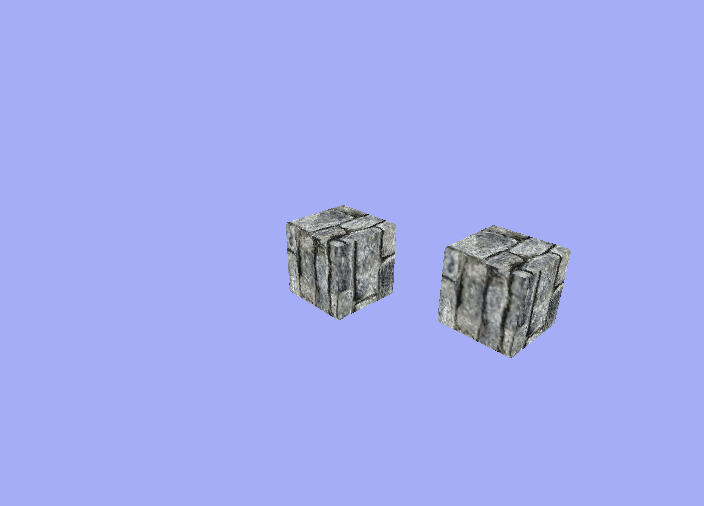
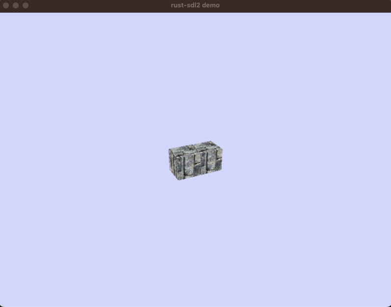

# node_simulator

Run node-based simulations with a graphical interface.

## Status


[](https://codecov.io/gh/SmithTom6304/node_simulator)

## Pre-requisites
- [Cargo](https://github.com/rust-lang/cargo)
- C compiler (e.g. `gcc`, `clang`) - this project makes use of the [rust-sdl2 "Bundled" feature](https://github.com/Rust-SDL2/rust-sdl2#bundled-feature)

## Build steps
- Install Cargo
- From the `node_simulator` directory
  - Build using `cargo build`
  - Run using `cargo run`
  - Run tests using `cargo test`

## Usage
Add a node to the scene.

```add node --id 1 --position 1,2,3```

Push the node around.

```set node --id 1 --velocity 1,0,0```

Get the nodes new position.

```get node --id 1 --position```

Use `--help` for more information.

## Examples
See the `./example_scripts` directory for some example scripts, that can be run using the `script` command.


A satellite node orbiting a central body.



Two nodes pushing eachother apart.